```mermaid
graph LR
    A["LiveRamp Sheet<br/>(Source)"] -->|"Daily Sync<br/>Thread_Key Hash"| B["Raw_Alerts Tab<br/>(Mirror + Metadata)"]
    B -->|"Status Calc<br/>New/Updated/Ongoing"| C["Working_Alerts Tab<br/>(Your Layer)"]
    C -->|"You Pick Template<br/>+ Add Notes"| D["Composed_Update<br/>(Preview)"]
    D -->|"Check Push Ready<br/>Menu: Push Now"| E["LiveRamp Column F<br/>(Append Comment)"]
    E -->|"User Marks Resolved"| F["Light Green Highlight<br/>Issue Closed"]
    
    style A fill:#e8f4f8
    style B fill:#fff9e6
    style C fill:#e8f8e8
    style E fill:#f8e8e8
    style F fill:#c8e6c9
```

# Horizon LiveRamp Status Tracker - Workflow Guide

## ⚡ TLDR (Quick Start - 3 Minutes)

1. **Daily Check**: Email arrives at 7:30 AM ET with new/updated LiveRamp issues
2. **Review**: Read the issue and what LiveRamp is asking us to do
3. **Respond**: Pick a template from dropdown, add notes if needed
4. **Send**: Check "Push Ready" box → Menu → "Push Updates Now"
5. **Close**: Check "Ready to Be Resolved" when done → Row highlights green

**That's it.** Everything else updates automatically.

---

## 📊 Data Flow: LiveRamp → Horizon Response → Resolved



---

## 🔄 Step-by-Step Workflow

### Step 1: Sync Happens (Automatic Daily)
**When**: 6:00 AM ET (before your email)
**What happens**:
- Script reads entire LiveRamp "Alerts" sheet (columns A-G, starting row 2)
- Creates **thread_key** = hash of (Product + Workflow + Issue + Request)
  - Same issue appearing on multiple days = same thread_key
- Creates **row_hash** = hash of entire row (A-G)
  - Detects if LiveRamp changed anything
- Stores **source_row_number** = which row in LiveRamp this came from
- Copies all 7 LiveRamp columns to **Raw_Alerts** tab (mirror)
- Populates **Working_Alerts** tab with status

### Step 2: Status Gets Assigned (Automatic)
**Working_Alerts column "HMI_Group"** gets set to one of:

| Status | Meaning | Color |
|--------|---------|-------|
| **New** | First time seeing this issue (new thread_key) | Light blue |
| **Updated** | LiveRamp changed the issue since last sync (row_hash changed) | Light yellow |
| **Ongoing** | Still there, but nothing new from LiveRamp | White |
| **Resolved** | You marked it as done (HMI_Ready_To_Be_Resolved checked) | Light green |

**Key insight**: Status recalculates EVERY SYNC. If LiveRamp edits something you marked resolved, it becomes "Updated" again.

### Step 3: Daily Email at 7:30 AM ET
**What arrives in your inbox**:
- **NEW section**: All "New" items (light blue table)
- **UPDATED section**: All "Updated" items (light yellow table)
- **ONGOING section**: All "Ongoing" items (white table)
- RESOLVED items are NOT shown (you're done with them)

**Columns in email**:
- Date (when reported)
- Product (what broke)
- Workflow/Audience (specific context)
- Issue & LR Action (problem description)
- Request to Horizon Team (what they want us to do)
- Horizon Comment (LR) (our previous responses with timestamps)
- Horizon Update (what we're doing NOW - this is what you wrote)

### Step 4: You Respond (Your Action)
**In Working_Alerts tab, for each issue:**

1. **Read the LiveRamp columns** (columns A-G):
   - Date, Product, Workflow, Issue, Request, LR Comment, Resolved checkbox

2. **Pick a template** (column H - HMI_Update_Template):
   - Click the dropdown
   - Choose from: "READY TO BE RESOLVED", "Waiting for response", "Cannot decommission", etc.
   - Options defined in **Templates tab** (user-editable)

3. **Add optional notes** (column I - HMI_Update_FreeText):
   - Type any additional context: "Waiting on vendor", "Need approval", "File size 2.5GB"
   - Can be blank if template is enough

4. **Preview your message** (column J - HMI_Composed_Update):
   - Auto-filled formula shows exactly what will be sent
   - Format: "Template, FreeText" or just one if only one filled in

### Step 5: Push to LiveRamp (Your Action)
**When ready to send your response:**

1. Check **HMI_Push_Ready** checkbox (column K)
2. Go to **menu → "Push Updates Now"**
3. Script appends your message to LiveRamp column F with timestamp:
   - Format: `MM/DD/YYYY h:mm AM/PM ET\nHorizon: <your message>`
   - Example: `02/11/2026 10:15 AM ET\nHorizon: Cannot decommission, still in use`

**Key safety feature**: Never overwrites previous comments. Always appends to preserve history.

### Step 6: Message Gets Recorded (Automatic)
**Columns update automatically after push:**
- **HMI_Last_Pushed_At**: Timestamp of push (column L)
- **HMI_Last_Pushed_Text**: Exact text that was sent (column M)
  - Used to prevent sending the same message twice

### Step 7: Mark as Resolved (Your Action)
**When issue is actually closed:**

1. Check **HMI_Ready_To_Be_Resolved** checkbox (column N)
2. Row highlights **light green** to show it's cleared
3. Next daily sync still shows it because LiveRamp might update it again
4. If LiveRamp edits it again after you marked resolved → row turns **light orange** (HMI_LR_Updated_After_Resolution flag)

### Step 8: Next Day Happens
**Next sync (6:00 AM ET):**
- Reads LiveRamp again
- Compares thread_keys:
  - Same thread_key + same row_hash = stays "Ongoing"
  - Same thread_key + DIFFERENT row_hash = becomes "Updated" (LiveRamp changed it)
  - You marked resolved but LiveRamp edited = "Updated" + orange flag
- Email at 7:30 AM refreshes with new status

---

## 🎯 Working_Alerts Column Reference

### You Edit These (5 Columns)

| Column | Name | Purpose | Example |
|--------|------|---------|---------|
| H | **HMI_Update_Template** | Pick from Templates dropdown | "Waiting for response" |
| I | **HMI_Update_FreeText** | Add context/notes | "Blocked by finance approval" |
| K | **HMI_Push_Ready** | Check when ready to send | ☑️ (checked) |
| N | **HMI_Ready_To_Be_Resolved** | Check when issue is done | ☑️ (checked) |
| O | **HMI_Notes_Internal** | Your personal notes (never sent) | "Vendor said 2 weeks ETA" |

### Read-Only (System Manages These)

**LiveRamp Source Columns** (synced daily, don't edit):
- Column A: **Date** - When issue was reported (M/D/YYYY)
- Column B: **Product** - Product name (Pixel, Onboarding, etc.)
- Column C: **Workflow/Audience Name** - Specific workflow affected
- Column D: **Issue & LR Action** - Problem description
- Column E: **Request to Horizon Team** - What LiveRamp wants us to do
- Column F: **Horizon Comment (LR)** - All our previous responses with timestamps
- Column G: **Resolved (LR)** - LiveRamp's resolve checkbox (TRUE/FALSE)

**Auto-Computed**:
- Column J: **HMI_Composed_Update** - Formula preview of what you're sending
- Column L: **HMI_Last_Pushed_At** - When your message was pushed (auto-filled)
- Column M: **HMI_Last_Pushed_Text** - Exact text that was pushed (auto-filled)
- Column P: **HMI_Group** - Status (New/Updated/Ongoing/Resolved)
- Column Q: **HMI_LR_Updated_After_Resolution** - Flag if LiveRamp edited after you marked resolved

**Tracking Columns** (system use, don't edit):
- Column R: **_thread_key** - Hash of (Product+Workflow+Issue+Request) - groups same issues
- Column S: **_row_hash** - Hash of entire row - detects LiveRamp changes
- Column T: **_source_row_number** - Which row in LiveRamp this came from

---

## 💡 Common Scenarios

### Scenario 1: New Issue Appears
```
Sync reads LiveRamp
↓
Thread_key doesn't match any previous rows
↓
HMI_Group = "New" (light blue)
↓
Email shows it at 7:30 AM in "NEW" section
↓
You pick template + notes
↓
Check "Push Ready" + menu "Push Updates Now"
↓
Message appends to LiveRamp column F
↓
Next sync: becomes "Ongoing" (you responded, nothing new from LR)
```

### Scenario 2: LiveRamp Edits Something You Already Responded To
```
You marked "Ongoing", sent message "Waiting for response"
↓
Next day: LiveRamp changes the issue description
↓
Sync detects row_hash changed
↓
HMI_Group = "Updated" (light yellow)
↓
Email shows it again in "UPDATED" section
↓
You pick new template if needed, push again
```

### Scenario 3: Issue Resolved
```
You check "HMI_Ready_To_Be_Resolved"
↓
Row highlights light green
↓
HMI_Group = "Resolved"
↓
Next day's email: NOT shown (resolved items hidden)
↓
BUT if LiveRamp edits it after you marked resolved:
   ↓ becomes "Updated" again + light orange flag
   ↓ Email shows it tomorrow in "UPDATED" section
```

### Scenario 4: Same Issue on Multiple Days
```
Day 1: LiveRamp reports "Cannot decommission workflow X"
↓
Thread_key = hash(Product="Pixel", Workflow="...", Issue="Cannot decommission", Request="...")
↓
You create update: "Still needed, cannot decommission"
↓
Day 2: Same issue appears again (same Product/Workflow/Issue/Request)
↓
Same thread_key discovered
↓
Row_hash unchanged (LiveRamp didn't edit it)
↓
HMI_Group = "Ongoing" (not "New" - we've seen this)
↓
Email shows it in "ONGOING" section
      ↓
      You respond again or do nothing
      ↓
      Next sync: stays "Ongoing" unless LiveRamp changes something
```

---

## 🤖 Automatic Triggers

| Trigger | Time (ET) | What It Does |
|---------|-----------|--------------|
| **Daily Sync** | 6:00 AM | Reads LiveRamp, calculates status, populates Working_Alerts |
| **Daily Email** | 7:30 AM | Sends email with New/Updated/Ongoing sections |
| **Auto Push** | 11:00 PM (weekdays only) | Pushes all "Push Ready" rows to LiveRamp automatically |

**Configuration**: All times + enable/disable in **Config tab**

---

## 🛠️ Manual Actions (Menu)

**From any sheet, click "Horizon LiveRamp" menu:**

- **Sync From LiveRamp** - Manually trigger sync (auto runs at 6:00 AM)
- **Push Updates Now** - Manually push all "Push Ready" rows (auto runs at 11:00 PM)
- **Send Email Now** - Manually send email (auto runs at 7:30 AM)
- **Refresh Templates** - Reload template dropdown (auto runs daily)
- **Admin** submenu:
  - **Run Diagnostics** - Check system health
  - **Reset All Data** - Delete and recreate all tabs (careful!)

---

## ⚠️ Important Notes

1. **Never edit LiveRamp columns** (A-G) - they sync automatically daily
2. **System tracked columns** (_thread_key, _row_hash, _source_row_number) - don't edit
3. **Message history preserved** - Never overwrites column F in LiveRamp. Always appends with timestamp.
4. **No manual HMI_Group edits** - Will be overwritten on next sync. It's calculated automatically.
5. **Push Ready gets unchecked** - After pushing, checkbox resets automatically to prevent duplicates
6. **Resolved items hide in email** - They're still in the spreadsheet, just not shown in daily email

---

## 📋 Templates Tab

**What it is**: List of pre-written responses you use in "HMI_Update_Template" dropdown

**How to edit**:
1. Go to **Templates tab**
2. Add new templates in column A
3. Menu → **Refresh Templates** (or wait for automatic daily refresh)
4. New options appear in HMI_Update_Template dropdown

**Example templates** (you customize these):
- "READY TO BE RESOLVED"
- "Waiting for response from vendor"
- "Cannot decommission - still in use"
- "Technical issue - investigating"
- "Workflow updated last week"

---

## 🔒 Safety & Data

- **Column F in LiveRamp never overwritten** - All Horizon comments append with timestamps
- **Previous edits preserved** - Can see full history in LR Column F
- **Deduplication** - Won't push the same message twice (HMI_Last_Pushed_Text prevents it)
- **Backups** - Raw_Alerts tab preserves complete mirror of what LiveRamp had each day
- **Logging** - Push_Log and Email_Log tabs track all actions

---

## ❓ FAQ

**Q: What if I check "Push Ready" but change my mind?**
A: Just uncheck it before the auto-push at 11:00 PM ET. Or manually push and the checkbox will uncheck automatically.

**Q: What happens if LiveRamp changes the same issue on day 2?**
A: Sync detects the change (row_hash different), marks it "Updated" (yellow), and it shows in the email again.

**Q: Can I manually change the HMI_Group status?**
A: Don't - it will be recalculated on the next sync. The system determines it based on thread_key + row_hash comparison.

**Q: What do the tracking columns (_thread_key, _row_hash) mean?**
A: Internal system use - they identify the issue and detect changes. Don't edit them.

**Q: If I mark something resolved but LiveRamp edits it, what happens?**
A: Next sync sets HMI_LR_Updated_After_Resolution flag (light orange highlight) and changes status back to "Updated". It will show in the email again.

**Q: Why do some issues stay "Ongoing" for days?**
A: Because LiveRamp didn't change them, and you didn't mark them resolved. They remain visible in the email daily as reminders until you take action or LiveRamp changes something.

**Q: Can I edit the LiveRamp columns (A-G) in my Working_Alerts tab?**
A: No - they sync automatically from LiveRamp daily. Next sync will overwrite any manual edits.

---

## 📞 Need Help?

Check the **Config tab** for all settings:
- LiveRamp_Sheet_URL - Where we read from
- Daily_Email_Time - When email sends
- Email_Recipients - Who gets the email
- And 8 more settings...

Run **Menu → Diagnostics** to check system health and see any errors.

---

*Last Updated: February 11, 2026*
*For technical details, see README_Technical.md in the repository.*
